# Azure Honeypot & SOC Lab


---

## The Problem This Solves

Most people have no idea how aggressive the internet is. The second a machine gets a public IP address, automated bots, scanners, and real threat actors start probing it. This project makes that invisible threat visible.

By deliberately exposing a Windows VM to the internet with no firewall protection, capturing every attack attempt in real time, enriching the logs with geographic data, and plotting the results on a live world map inside a SIEM, this lab answers a question that actually matters in security operations: who is attacking us, from where, and how often?

This is not a simulated environment. Every failed login on the map is a real person or bot that found the machine and tried to break in.

---

## What Was Built

A fully functional cloud-based Security Operations Center using Microsoft Azure, including a honeypot VM, a centralized log pipeline, a SIEM, and a live attack visualization dashboard. The entire stack was built from scratch on a free Azure subscription.

---

## Architecture

```
Internet Attackers
       ↓
FINCORP-NET-EAST-1 (Windows 10 Honeypot VM — publicly exposed, firewalls off)
       ↓
Azure Monitor Agent (forwards Windows Security Events automatically)
       ↓
LAW-soc-lab-0001 (Log Analytics Workspace — central log repository)
       ↓
Microsoft Sentinel (SIEM — querying, enrichment, visualization)
       ↓
GeoIP Watchlist (maps attacker IPs to real-world locations)
       ↓
Live Attack Map (Sentinel Workbook — plots every attacker on a world map)
```

---

## Technologies Used

| Tool | Purpose |
|------|---------|
| Microsoft Azure | Cloud infrastructure |
| Windows 10 VM | Honeypot target exposed to the internet |
| Network Security Group | Cloud firewall configured to allow all inbound traffic |
| Azure Monitor Agent | Forwards VM logs to the log repository |
| Log Analytics Workspace | Centralized log storage and querying |
| Microsoft Sentinel | SIEM for detection, enrichment, and visualization |
| KQL (Kusto Query Language) | Querying and filtering security events |
| GeoIP Watchlist | Resolves attacker IPs to physical locations |

---

## Build Steps

### 1. Create Resource Group
Created `RG-SOC-Lab` in East US 2 as the container for all lab resources.

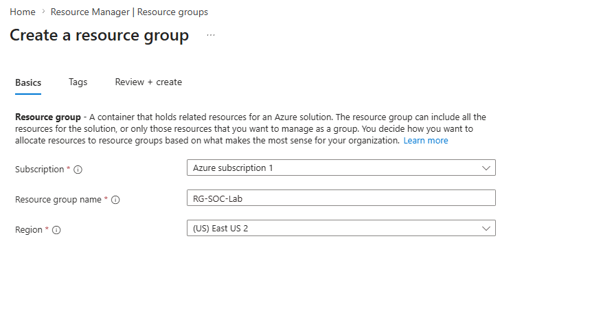

### 2. Deploy Virtual Network
Deployed `Vnet-Soc-Lab` to provide the network fabric the honeypot VM connects to.

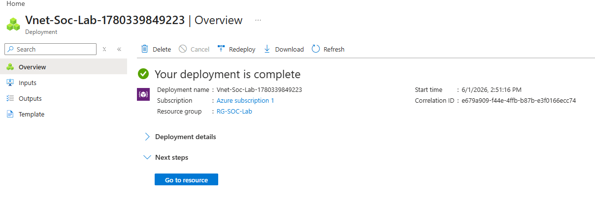

### 3. Deploy the Honeypot VM
Deployed a Windows 10 VM named `FINCORP-NET-EAST-1` with a public IP address. The hostname was chosen to resemble a corporate financial server — the kind of target attackers actively seek out.

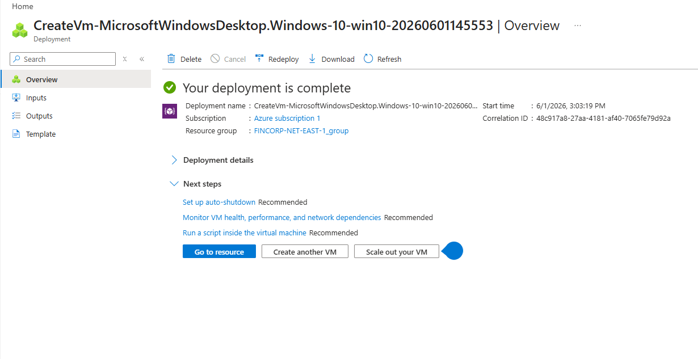

After deployment the following resources were automatically created inside RG-SOC-Lab:

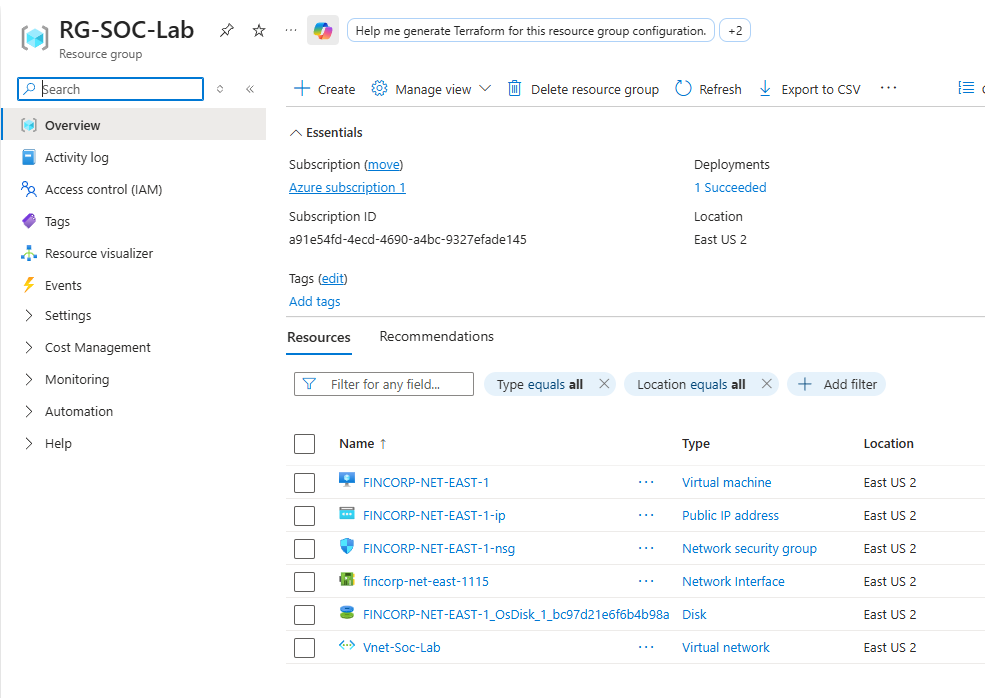

### 4. Open the Network Security Group
Removed the default RDP-only inbound rule and replaced it with `DANGER-AllowAnyCustomAnyInbound` — a rule that allows all traffic from any source on any port. This makes the VM fully discoverable and reachable by anyone on the internet.

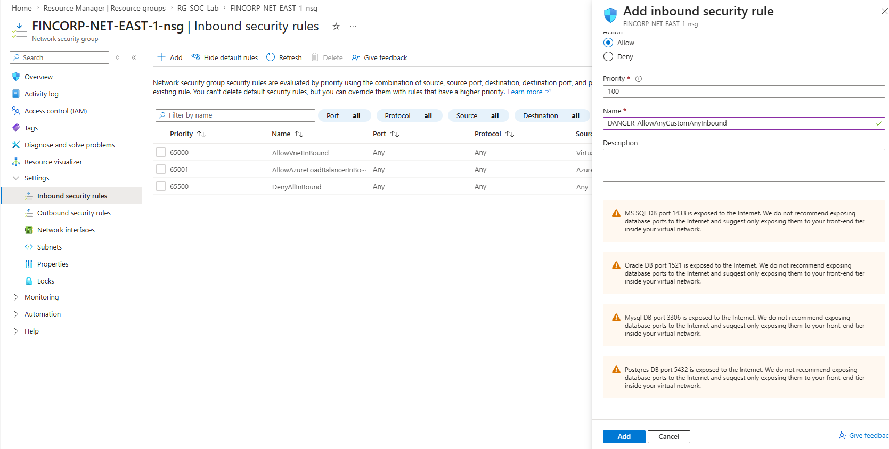

### 5. Disable Windows Defender Firewall
Connected to the VM via Remote Desktop and disabled Windows Defender Firewall across all three profiles (Domain, Private, Public) using `wf.msc`. This removes the last layer of protection and ensures no connection attempts get silently dropped.

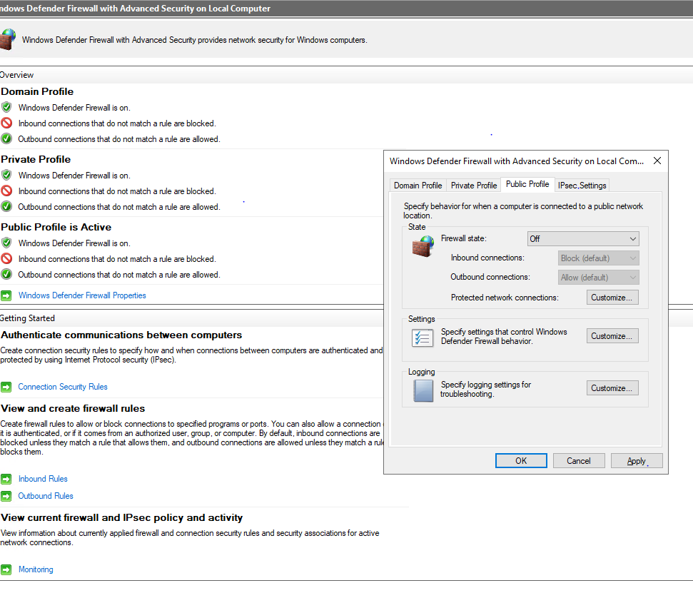

### 6. Confirm the Machine Is Publicly Reachable
Ran a ping test from a local machine against the VM's public IP to confirm it is fully exposed to the internet. Successful replies mean attackers can reach it too.

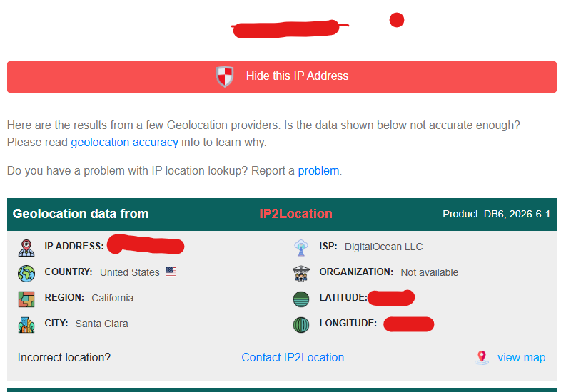


### 7. Deploy the Log Analytics Workspace
Created `LAW-soc-lab-0001` as the central log repository. All Windows Security Events from the honeypot VM are forwarded here and stored for querying.

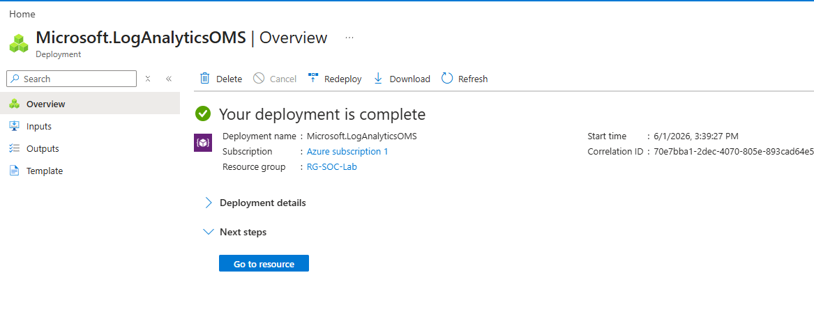

### 8. Connect Sentinel and Configure the Log Pipeline
Connected Microsoft Sentinel to the Log Analytics Workspace, installed the Windows Security Events solution from Sentinel Content Hub, and created a Data Collection Rule (DCR) to configure the Azure Monitor Agent on the VM to forward all security events automatically.

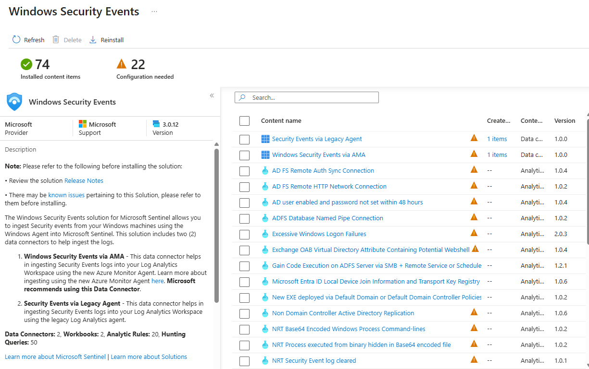

### 9. Query Incoming Attack Logs with KQL
Once logs started flowing in, KQL was used to filter and inspect the attack traffic. Event ID 4625 is the key indicator — it fires every time someone fails to log in.

```kql
SecurityEvent
| project TimeGenerated, Account, Computer, EventID, Activity, IpAddress
```

```kql
SecurityEvent
| where EventID == 4625
| project TimeGenerated, Account, Computer, IpAddress, Activity
```

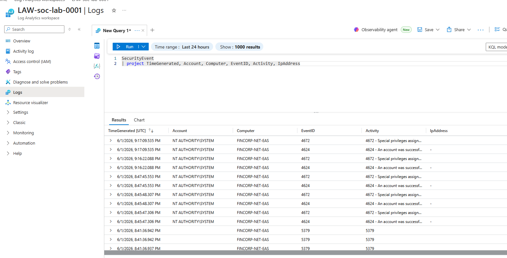

| Event ID | Meaning |
|----------|---------|
| 4625 | Failed logon attempt — the primary attack signal |
| 4624 | Successful logon |
| 4672 | Special privileges assigned to a new logon |
| 5379 | Credential Manager credentials read |

### 10. Upload the GeoIP Watchlist
Created a Sentinel watchlist named `geoip` containing approximately 55,000 records that map IP address network blocks to physical locations including city, country, latitude, and longitude. This is what allows the SIEM to turn a raw IP address into a point on a map.

```kql
_GetWatchlist("geoip")
| take 5
```

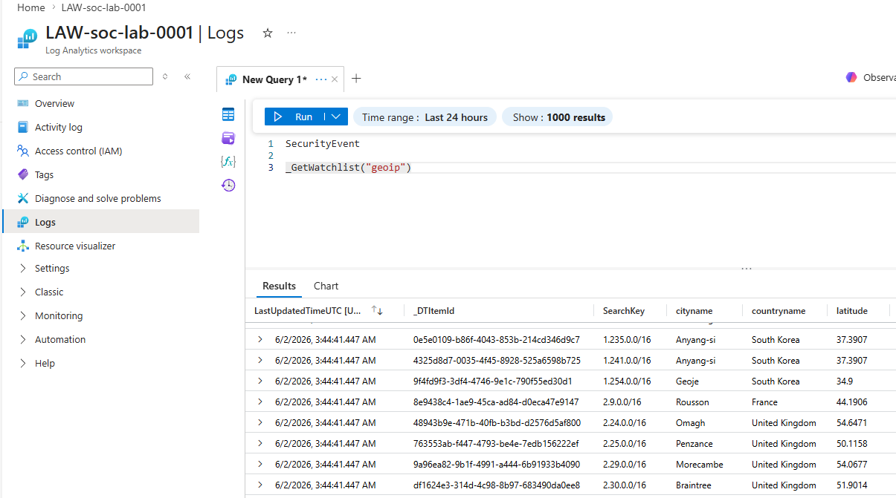

### 11. Enrich Attack Logs with Location Data
Used the `ipv4_lookup` function to join each attacker IP address against the GeoIP watchlist, resolving every failed login to a real-world city and country.

```kql
let GeoIPDB_FULL = _GetWatchlist("geoip");
let WindowsEvents = SecurityEvent
    | where EventID == 4625
    | order by TimeGenerated desc
    | evaluate ipv4_lookup(GeoIPDB_FULL, IpAddress, network);
WindowsEvents
| project TimeGenerated, Computer, AttackerIp = IpAddress, cityname, countryname, latitude, longitude
```

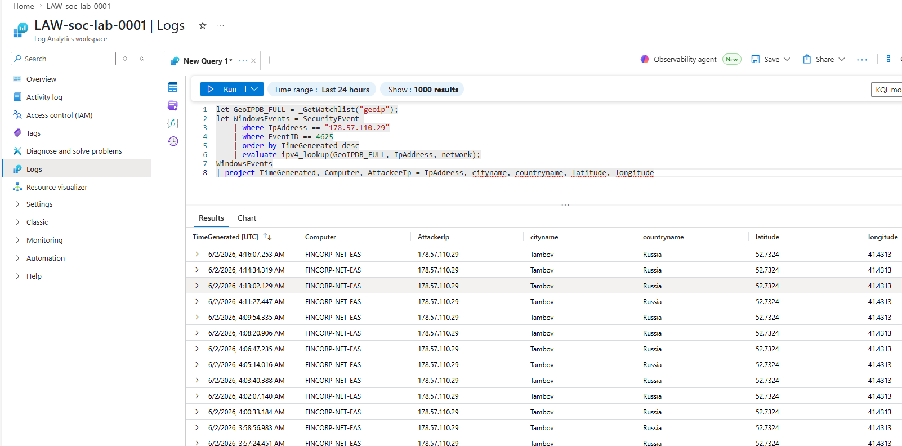

### 12. Build the Live Attack Map
Created a Sentinel Workbook that aggregates all failed logins by location and renders them as a heatmap on a world map. Bubble size represents attack volume. The map updates automatically as new attacks arrive.

```kql
let GeoIPDB_FULL = _GetWatchlist("geoip");
let WindowsEvents = SecurityEvent;
WindowsEvents | where EventID == 4625
| order by TimeGenerated desc
| evaluate ipv4_lookup(GeoIPDB_FULL, IpAddress, network)
| summarize FailureCount = count() by IpAddress, latitude, longitude, cityname, countryname
| project FailureCount, AttackerIp = IpAddress, latitude, longitude,
  city = cityname, country = countryname,
  friendly_location = strcat(cityname, " (", countryname, ")")
```

---

## Attack Map — Results After 24 Hours

After leaving the honeypot running for 24 hours, the machine received over 130,000 real failed login attempts from threat actors and automated bots spanning every continent. The map below shows exactly where the attacks originated.

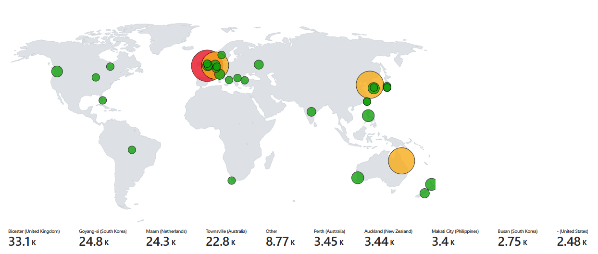

| Location | Failed Login Attempts |
|----------|----------------------|
| Bicester, United Kingdom | 33,100 |
| Goyang-si, South Korea | 24,800 |
| Maam, Netherlands | 24,300 |
| Townsville, Australia | 22,800 |
| Other | 8,770 |
| Perth, Australia | 3,450 |
| Auckland, New Zealand | 3,440 |
| Makati City, Philippines | 3,400 |
| Busan, South Korea | 2,750 |
| United States | 2,480 |

**Total: 130,290+ failed login attempts in under 24 hours.**

The machine was never advertised, listed, or announced anywhere. It was found purely by automated scanners constantly sweeping the internet for exposed machines. The UK being the top source likely indicates a network of compromised servers being used as proxies rather than attacks originating from UK-based threat actors directly.

This is the baseline threat level facing any internet-connected machine with an open port and no protection.

---

## What the Data Showed

- The VM was discovered and attacked within minutes of going live
- Over 130,000 failed login attempts recorded in under 24 hours
- Attacks originated from every major continent simultaneously
- Attackers cycled through common usernames like administrator, admin, and user
- Attack attempts arrived constantly with no breaks throughout the night
- NT AUTHORITY\SYSTEM events (4624, 4672) are normal Windows background activity — not attacker traffic
- Real attacker events are always identified by an external IP address paired with event ID 4625

The takeaway is not that any one country is uniquely dangerous. It is that any machine with an open port and a public IP is a target, constantly, from everywhere, regardless of whether anyone knows it exists.

---

## Skills Demonstrated

- Microsoft Azure (resource groups, virtual networks, VMs, NSGs, public IP management)
- Microsoft Sentinel (SIEM deployment, data connectors, watchlists, workbooks)
- Log Analytics (KQL querying, SecurityEvent table, ipv4_lookup enrichment)
- Windows Security (Event IDs, firewall configuration, RDP, audit logging)
- Threat intelligence (GeoIP enrichment, attacker IP analysis, brute-force detection)
- SOC fundamentals (log pipeline design, separating signal from noise, attack visualization)
